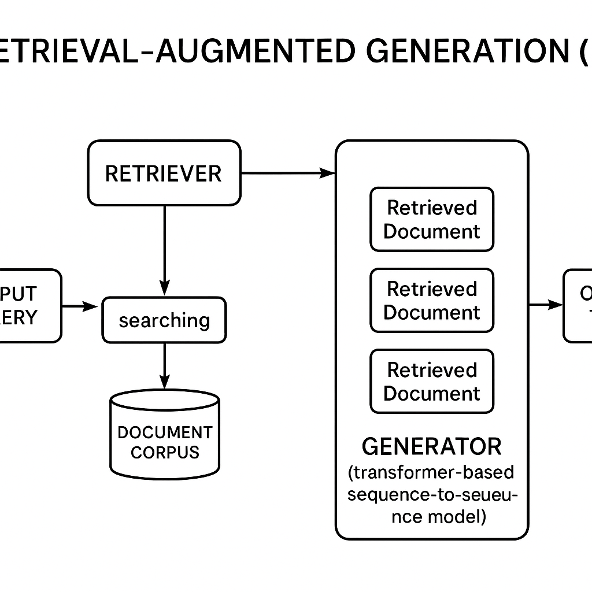
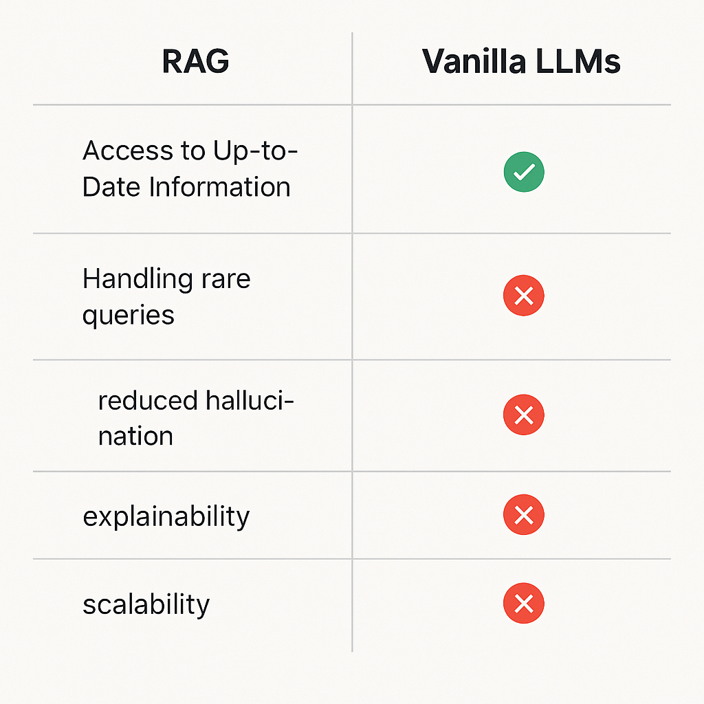

# What is RAG and Why It Beats Vanilla LLMs

## Introduction to RAG (Retrieval-Augmented Generation)

Retrieval-Augmented Generation (RAG) is an advanced approach in natural language processing that combines the strengths of retrieval-based methods and generative models. The core idea behind RAG is to enhance the generation of text by incorporating relevant information retrieved from a large external knowledge base or document collection. This enables the model to produce more accurate, informative, and contextually relevant responses.

The basic components of RAG include:

1. **Retriever:** This component searches a large corpus or database to find documents or passages that are most relevant to the input query. It typically uses techniques like dense vector similarity search or traditional information retrieval methods to identify pertinent information.

2. **Generator:** Using the retrieved documents as additional context, the generator1usually a sequence-to-sequence model such as a transformer1produces the final output text. By conditioning on both the query and the retrieved evidence, the generator can create responses that are grounded in factual knowledge.

Together, these components allow RAG models to leverage external knowledge dynamically during generation, improving the quality and reliability of generated content compared to models that rely solely on learned parameters.

*Architecture of Retrieval-Augmented Generation (RAG) combining retrieval and generation components.*

## Explain Vanilla LLMs

Vanilla large language models (LLMs) refer to the foundational versions of language models that are trained on vast amounts of text data without any specialized fine-tuning or additional modifications. These models are designed to predict and generate human-like text based on the patterns they have learned during their initial training phase. Essentially, vanilla LLMs serve as the base upon which more specialized or fine-tuned models can be built.

While vanilla LLMs are powerful in understanding and generating language, they have several limitations. They may lack domain-specific knowledge or the ability to perform specialized tasks effectively without further fine-tuning. Additionally, vanilla LLMs can sometimes produce outputs that are generic, ambiguous, or even factually incorrect because they rely solely on the patterns in the training data without contextual adaptation. Their responses may also reflect biases present in the training data, and they might struggle with understanding nuanced instructions or complex reasoning tasks.

## Comparison of RAG with Vanilla LLMs

Retrieval-Augmented Generation (RAG) significantly outperforms vanilla Large Language Models (LLMs) in several key areas:

1. **Access to Up-to-Date Information**  
   Vanilla LLMs rely solely on the knowledge encoded during their training, which can become outdated quickly. In contrast, RAG integrates a retrieval component that fetches relevant, up-to-date documents from external knowledge bases at inference time, enabling it to provide more current and accurate responses.

2. **Handling of Rare or Niche Queries**  
   Vanilla LLMs may struggle with rare or highly specialized topics due to limited exposure during training. RAG mitigates this by retrieving specific documents related to the query, allowing it to generate informed answers even on obscure subjects.

3. **Reduced Hallucination**  
   By grounding generation in retrieved factual documents, RAG reduces the tendency to hallucinate or fabricate information, a common issue in vanilla LLMs that generate text solely based on learned patterns.

4. **Improved Explainability**  
   RAGs retrieval step provides explicit evidence supporting its answers, enhancing transparency and trustworthiness. Vanilla LLMs, however, generate responses without direct citations, making it harder to verify their outputs.

5. **Scalability and Adaptability**  
   Updating a vanilla LLMs knowledge requires costly retraining, whereas RAG systems can adapt quickly by updating or expanding their retrieval corpus without retraining the generative model.

Overall, RAG combines the strengths of retrieval systems and generative models to deliver more accurate, reliable, and contextually relevant responses than vanilla LLMs.

*Comparison of Retrieval-Augmented Generation (RAG) versus Vanilla Large Language Models (LLMs) across key features.*

### Use Cases of Retrieval-Augmented Generation (RAG)

Retrieval-Augmented Generation (RAG) models combine the strengths of large language models (LLMs) with external knowledge retrieval systems, enabling them to access and incorporate up-to-date or domain-specific information beyond their training data. This hybrid approach excels in several practical applications where vanilla LLMs may struggle due to limited context or outdated knowledge.

1. **Open-Domain Question Answering**  
   RAG models can retrieve relevant documents or passages from large corpora and generate precise answers grounded in those sources. This capability is particularly valuable for answering questions on niche topics or recent events that are not covered in the LLMs training data.

2. **Customer Support and Helpdesk Automation**  
   By retrieving relevant product manuals, FAQs, or policy documents, RAG-powered systems provide accurate and context-aware responses to customer queries. This reduces the risk of hallucinations and improves user satisfaction compared to vanilla LLMs that rely solely on memorized knowledge.

3. **Legal and Compliance Research**  
   In domains requiring up-to-date regulatory or legal information, RAG models can fetch and synthesize relevant statutes, case law, or compliance guidelines. This ensures that generated content reflects the latest rules and reduces the burden on human experts.

4. **Scientific Literature Review and Summarization**  
   Researchers can leverage RAG to retrieve pertinent scientific papers or datasets and generate summaries or insights that are grounded in the latest findings. This is especially useful in rapidly evolving fields where vanilla LLMs may lack current knowledge.

5. **Personalized Education and Tutoring**  
   RAG enables educational platforms to tailor responses based on a students learning materials or textbooks by retrieving relevant content and generating explanations or exercises aligned with the curriculum.

In all these use cases, RAGs ability to dynamically access external knowledge bases allows it to overcome the limitations of static LLMs, providing more accurate, relevant, and trustworthy outputs.

## Challenges and Limitations of RAG

Retrieval-Augmented Generation (RAG) offers significant advantages in enhancing the quality and relevance of generated content by combining retrieval mechanisms with generative models. However, implementing RAG also presents several challenges and limitations that must be carefully considered.

1. **Complexity of Integration**  
   Integrating retrieval systems with generative models increases the overall system complexity. Ensuring seamless interaction between the retriever and generator components requires sophisticated engineering and tuning, which can be resource-intensive.

2. **Dependence on Retrieval Quality**  
   The performance of RAG heavily depends on the quality and relevance of the retrieved documents. If the retrieval component returns irrelevant or low-quality information, the generated output may be inaccurate or misleading.

3. **Scalability Issues**  
   Handling large-scale retrieval databases efficiently poses scalability challenges. As the size of the knowledge base grows, maintaining fast and accurate retrieval becomes computationally demanding, potentially affecting response times.

4. **Latency Concerns**  
   The two-step process of retrieval followed by generation can introduce latency, which may be problematic for real-time applications requiring instant responses.

5. **Bias and Misinformation Propagation**  
   RAG systems can inadvertently propagate biases or misinformation present in the retrieved documents. Without careful curation and filtering, the generated content may reflect these issues, impacting reliability.

6. **Maintenance and Updating**  
   Keeping the retrieval database up-to-date is essential for maintaining the relevance of generated content. This ongoing maintenance requires continuous effort and infrastructure support.

7. **Evaluation Difficulties**  
   Evaluating RAG systems is more complex than evaluating standalone generative models, as it involves assessing both retrieval accuracy and generation quality, often necessitating specialized metrics and human judgment.

Understanding these challenges is crucial for deploying RAG systems effectively and responsibly, ensuring that their benefits are maximized while mitigating potential drawbacks.

## Summarize and Conclude

Retrieval-Augmented Generation (RAG) offers significant advantages over vanilla Large Language Models (LLMs) by combining the generative capabilities of LLMs with the precision and up-to-date knowledge of external retrieval systems. This hybrid approach enables RAG models to access vast, dynamic information repositories, resulting in more accurate, contextually relevant, and factually grounded responses. Unlike traditional LLMs, which rely solely on pre-trained knowledge and may struggle with outdated or niche information, RAG systems can continuously integrate new data, enhancing their adaptability and reliability.

Looking ahead, the future potential of RAG is promising. As retrieval techniques and indexing methods improve, RAG models are expected to become even more efficient and scalable, supporting a wider range of applications from real-time question answering to personalized content generation. Furthermore, integrating RAG with advancements in multimodal data retrieval and reasoning could unlock new frontiers in AI capabilities, making it a pivotal approach in the evolution of intelligent systems.
